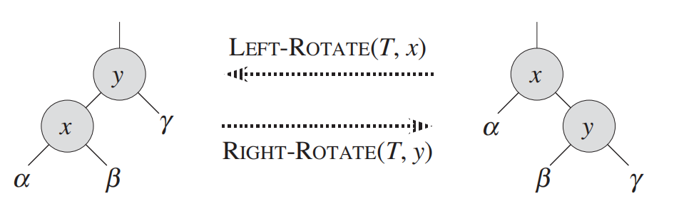
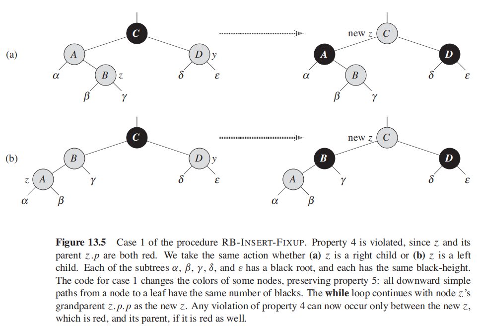
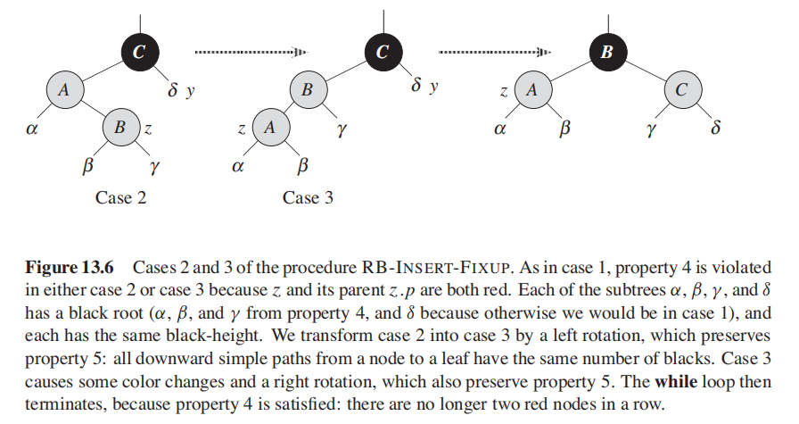
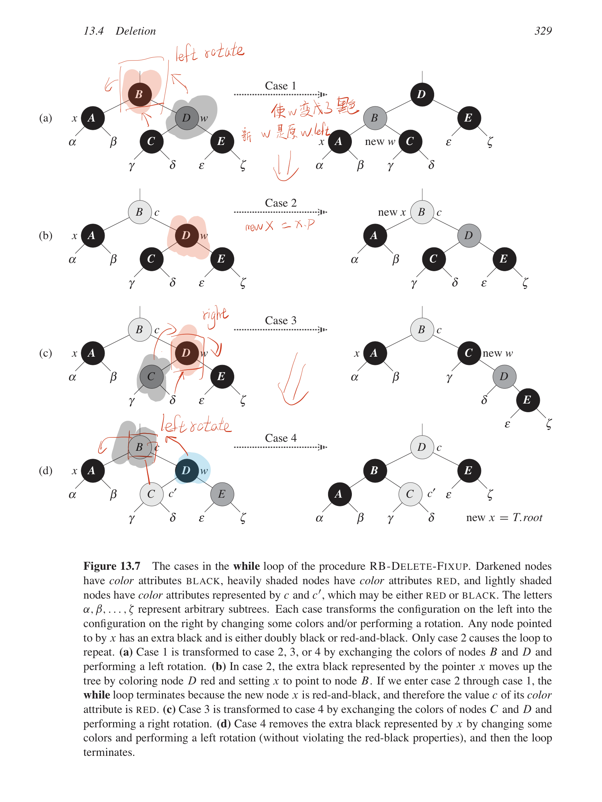

# 数据结构
动态集合通常包括如下的常见操作
- SEARCH(S, k): 查找一个集合中的k元素的位置
- INSERT(S, x): 将新的元素插入到集合中
- DELETE(S, x): 从集合中删除一个指定的元素x
- MINIMUM(S): 找到集合中的最小的元素
- MAXIMUM(S): 找到集合中的最大的元素
- SUCCESSOR(S, x): 找到集合中某个元素的后继元素
- PREDECESSOR(S, x): 找到集合中某个元素的前一个元素

# 栈
栈的特点是先进后出“Last in, First out”，栈数据结构的 insert 通常叫做 push ，delete 操作通常叫做 pop。

## 用数组实现栈数据结构
```
STACK-EMPTY(S)
    if S.top == 0
        return TRUE
    else return FALSE

PUSH(S, x)
    S.top = S.top + 1
    S[S.top] = x

POP(S)
    if STACK-EMPTY(S)
        error "underflow"
    else S.top = S.top-1
        return S[S.top + 1]
```
# 队列
队列的 insert 操作通常叫做 enqueue，delete 操作通常叫做 dequeue，队列的特点是先进先出，“First in, first out”。

## 用数组实现队列
- 一个大小为 n 的队列可以表示 n-1 个元素的队列，队列有 head 和 tail 属性，元素为`Q.head, Q.head+1, ... ,Q.tail-1`。
- 判断队列为空：Q.head == Q.tail, 初始化时，Q.head = Q.tail = 0；当我们对一个为空的队列执行 dequeue 操作成为下溢（underflows）。
- 判断队列已满，`Q.head == Q.tail + 1`；如果尝试向一个已经满了的队列加入元素，成为溢出（overflows）

```
// 忽略了对队列溢出检查的伪代码

ENQUEUE(Q, x)
    Q[Q.tail] = x
    if Q.tail == Q.length
        Q.tail = 1
    else
        Q.tail = Q.tail + 1


DEQUEUE(Q)
    x = Q[Q.head]
    if Q.head == Q.length
        Q.head = 1
    else
        Q.head = Q.head + 1
    return x

```

# 链表
- 列表分为很多种类：双向链表、单向链表；有序链表、无序链表、循环链表等。
- 双向链表中的每个节点都有如下属性 `key, next, prev`；

## 用指针实现链表
```
// 链表的搜索
LIST-SEARCH(L, x)
    x = L.head
    while x != NIL and x.key != k
        x = x.next
    return x

// 在链表的头部插入元素
LIST-INSERT(L, x)
    x.next = L.head
    if L.head != NIL
        L.head.prev = x
    L.head = x
    x.prev = NIL

// 从链表中删除元素
LIST-DELETE(L, x)
    if x.prev != NIL
        x.prev.next = x.next
    else 
        L.head == x.next
    if x.next != NIL
        x.next.prev = x.prev
```

## 通过插入 NIL 节点可以不用区分链表的首位节点


始终保持一个空节点（也叫哨兵节点）用来表示空节点，连接头节点和尾节点，可以简化链表的算法

```
LIST-DELETE'(L, x)
    x.prev.next = x.next
    x.next.prev = x.prev

LIST-SEARCH'(L, k)
    x = L.nil.next
    while x != L.nil and x.key != k
        x = x.next
    return x

LIST-INSERT'(L, x)
    x.next = L.nil.next
    L.nil.next.prev = x
    L.nil.next = x
    x.prev = L.nil
```

## 使用数组实现链表
1. 用三个数组`next, key, prev`，可以表示出链表；
2. 用一个数组，通过设置 offset 来实现，相邻的三个元素分别表示 `next， key， prev`信息；
3. 分配和管理空闲空间，通过增加一个单向链表来进行分配和管理链表元素。

# 有根数的表达
为了表示节点的孩子节点数目不限制且非常不均衡的有根数，可以用类似于链表的表示方法
- 用`x.left-child`表示x节点的最左边的孩子节点；
- 用`x.right-sibling`指针信息表示x的右边的兄弟节点；
最终，每个节点有如下信息：`parent, left-child, right-sibling`;

# 二叉搜索树
二叉搜索树可以用作字典和有限队列，二叉搜索树的基本动态集合操作的时间复杂度是O(logn)

## 基本问题
1. 如何遍历二叉搜索树输出有序序列；
 > 中序遍历可以输出从小到大排序的有序数列

2. 如何从二叉搜索树中搜索到某个数值的节点；
3. 找到最大值和最小值；
 > 树的最左孩子节点是最小值；树的最右孩子节点是最大值；
4. 找到某个节点的前一个节点(小一)和后一个节点（大一）；
 > 右支的最左孩子节点是后一个节点；左支的最右孩子节点是前一个节点；
5. 如何插入、删除元素；

**二叉搜索树的表示**
二叉搜索树可以使用链接的数据结构表示，每个节点对象包括`key`属性用来存储数据，并包含`left, right, p`属性分别指向该节点的左孩子、右孩子和父亲节点的对象。

**二叉搜索树的属性**
假设 x 是二叉搜索树上的一个节点，如果 y 是 x 左支的节点，则 y.key <= x.key ，如果 y 是 x 右支的节点，则 y.key >= x.key。

```
// 中序遍历，获得顺序序列（递归）
INORDER-TREE-WALK(x)
    if x != NIL
        INORDER-TREE-WALK( x.left )
        print x.key
        INORDER-TREE-WALK( x.right )

// 搜索某一个节点(递归)
TREE-SEARCH(x, k)
    if x == NIL or k == x.key
        return x
    if k < x.key
        return TREE-SEARCH( x.left, k )
    else
        return TREE-SEARCH( x.right, k )

// 搜索某一个节点（迭代）
ITERATIVE-TREE-SEARCH(x, k)
    while x != NIL and k != x.key
        if k < x.key
            x = x.left
        else
            x = x.right
    return x

// 查找最小值 （最左孩子节点）
TREE-MINIMUM(x)
    while(x.left != NIL)
        x = x.left
    return x

// 查找最大值 （最右孩子节点）
TREE-MAXIMUM(x)
    while x.right != NIL
        x = x.right
    return x

// 查找后续节点
TREE-SUCCESSOR(x)
    if x.right != NIL
        return TREE-MINIMUM(x.right)
    y = x.p
    while y != NIL and x == y.right
        x = y
        y = y.p
    return y

// 查找前序节点
TREE-PREDECESSOR(x)
    if x.left != NILL
        return TREE-MAXIMUM(x.left)
    y = x.p
    while y != NIL and x == y.left
        x = y
        y = y.p
    return y

// 插入节点
TREE-INSERT(T, z)
    y = NIL
    x = T.root
    while x != NIL
        y = x
        if z.key < x.key
            x = x.left
        else x = x.right
    z.p = y
    if y == NIL
        T.root = z // tree T was empty
    else if z.key < y.key
        y.left = z
    else y.right = z

// 迁移
TRANSPLANT(T, u, v)
    if u.p == NIL
        T.root = v
    elseif u == u.p.left
        u.p.left = v
    else 
        u.p.right = v
    if v != NIL
        v.p = u.p

// 删除节点
TREE-DELETE(T, z)
    if z.left == NIL
        TRANSPLANT(T, z, z.right)
    elseif z.right == NIL
        TRANSPLANT(T, z, z.left)
    else 
        y = TREE-MINIMUM(z.right)
        if y.p != z
            TRANSPLANT(T, y, y.right)
            y.right = z.right
            y.right.p = y
        TRANSPLANT(T, z, y)
        y.left = z.left
        y.left.p = y
```

# 红黑树
红黑树是平衡的查找树的一种，最坏的基本操作的时间复杂度是 O(lgn)。

红黑树是一棵二叉搜索树，每个结点增加了一个颜色属性，可以标识为红色或黑色，通过对任意一条从根结点到叶子结点的路径上的颜色做约束，保证没有任意一条路径比其他的路径长出2倍，因此近乎是平衡的。

红黑树的每个结点包含5个属性：`color, key, left, right, parent`。

**红黑树属性**
1. 每个结点必须是红色或者黑色中的一种颜色；
2. 根结点的颜色是黑色的；
3. 每个叶子结点是黑色的（NIL结点）；
4. 如果一个结点是红色的，则它的两个子节点都是黑色的；
5. 对每个结点，从该结点到其所有的后代叶结点的简单路径上，均包含相同数目的黑色结点；

**黑高**：从某个结点x出发到叶子结点的任意一条简单路径的所经过的黑色结点的个数；
**高度**：一棵有n个内部结点的红黑树的高度至多是`2lg(n+1)`

## 算法
```
// 旋转，左旋与右旋对称
LEFT-ROTATE(T, x)
    y = x.right         // set y
    x.right = y.left    // turn y's left subtree into x's right subtree
    if y.left != T.nil
        y.left.p = x
    y.p = x.p           // link x's parent to y
    if x.p == T.nil
        T.root = y
    elseif x == x.p.left
        x.p.left = y
    else
        x.p.right = y
    y.left = x          // put x on y's left
    x.p = y
```


### 插入
```
RB-INSERT(T, z)
    y = T.nil
    x = T.root
    while x != T.nil
        y = x
        if z.key < x.key
            x = x.left
        else
            x = x.right
    z.p = y
    if y == T.nil
        T.root = z
    elseif z.key < y.key
        y.left = z
    else 
        y.right = z
    z.left = T.nil
    z.right = T.nil
    z.color = RED
    RB-INSERT-FIXUP(T,z)
// 红黑树的插入与二叉搜索书的插入有四处不同
// 1. 将 nil 更改为哨兵方式，使用 T.nil替代
// 2. 置 z.left 和 z.right 为 T.nil ，保持合理的树结构
// 3. 将 z 初始化为红色
// 4. 因为将 z 置为红色时可能违反属性2 和属性4，所以使用 Fixup 函数保持红黑树的性质。

RB-INSERT-FIXUP(T, z)
    while z.p.color == RED
        if z.p == z.p.p.left
            y = z.p.p.right
            if y.color == RED
                z.p.color = BLACK       // case 1
                y.color = BLACK         // case 1
                z.p.p.color = RED       // case 1
                z = z.p.p               // case 1
            else
                if z == z.p.right       // case 2
                    z = z.p             // case 2
                    LEFT-ROTATE(T, z)   // case 2
                z.p.color = BLACK       // case 3
                z.p.p.color = RED       // case 3
                RIGHT-ROTATE(T, z.p.p)  // case 3
        else
            // 与上方对称，将 left 与 right 颠倒一下
    T.root.color = BLACK

// Case 1: y 的父节点的兄弟结点是红色 （z是红色，z的父亲结点和父亲的兄弟节点都是红色）
// Case 2: z 的父亲的兄弟结点是黑色，且 z 是一个右孩子 (z是红色，z的父亲结点是红色，但父亲结点的兄弟节点是黑色) 
//           - 需要转换为 Case 3 然后在进行处理
// Case 3: z 的父亲的兄弟结点是黑色的，且z是一个左孩子
```

Case 1:


Case 2 and Case 3:


### 删除
删除一个结点需要时间复杂度O(lgn)，删除结点的操作相对复杂些。

```
RB-TRANSPLANT(T, u, v)
    if u.p == T.nil
        T.root = v
    elseif u == u.p.left
        u.p.left = v
    else 
        u.p.right = v
    v.p = u.p

// 与二叉搜索树的删除相比，多了几行代码记录y的踪迹，因为y有可能导致红黑树的性质被破坏
// 当想要删除结点z，如果z的子节点少于2个时，z从树中删除，并让y成为z。
// 当z有两个子节点时，y应该是z的后序，并且y将移动到z的位置，
// 在结点被移动之前，需要记住y的颜色，并记录结点 x 的总计，将x移动至树中y的原来位置，
// 因为结点x也可能引起红黑树的属性的破坏，删除结点 z 之后，红黑树调用了FIXUP来恢复红黑性质
// 如果y是黑色的，则删除和移动y可能会导致红黑树的属性发生破坏，
// 当y是红色时，(删除后黑高不变，并不破坏红黑树性质;不存在相邻的红色结点)

RB-DELETE(T, z)
    y = z
    y-original-color = y.color
    if z.left == T.nil
        x = z.right
        RB-TRANSPLANT(T, z, z.right)
    elseif z.right == T.nil
        x = z.left
        RB-TRANSPLANT(z, z, z.left)
    else
        y = TREE-MINIMUM(T, y, y.right)
        y-original-color = y.color
        x = y.right
        if y.p == z
            x.p = y
        else
            RB-TRANSPLANT(T, y, y.right)
            y.right = z.right
            y.right.p = y
        RB-TRANSPLANT(T, z, y)
        y.left = z.left
        y.left.p = y
        y.color = z.color
    if y-original-color == BLACK
        RB-DELETE-FIXUP(T, x)

RB-DELETE-FIXUP(T, x)
    while x != T.root and x.color == BLACK
        if x == x.p.right
            w = x.p.left
            if w.color == RED
                w.color = BLACK          // case 1
                x.p.color = RED          // case 1
                LEFT-ROTATE(T, x.p)      // case 1
                w = x.p.right            // case 1
            if w.left.color == BLACK and w.right.color == BLACK
                w.color = RED            // case 2
                x = x.p                  // case 2
            else 
                if w.right.color == BLACK
                    w.left.color = BLACK // case 3
                    w.color = RED        // case 3
                    RIGHT-ROTATE(T, w)   // case 3
                    w = x.p.right        // case 3
                w.color = x.p.color      // case 4
                x.p.color = BLACK        // case 4
                w.right.color = BLACK    // case 4
                LEFT-ROTATE(T, x.p)      // case 4
                x = T.root               // case 4
        else
            // 对称， 交换 left 和right
    x.color = BLACK
 
```
如果 y 是黑色，会产生三个问题：
1. y是原来的根节点，y的一个红色孩子成为了根节点，违反了性质2；
2. x和x.p是红色的，违反了性质4；
3. 在树中移动了y结点，导致一条路径上的黑色结点少一，违反了性质5；（将任意包含x的简单路径上黑色结点数量增加1）



- Case 1: x 的兄弟结点 w 是红色的；（转换成Case 2 || 3 || 4 处理）
- Case 2: x 的兄弟结点 w 是黑色的，而且 w 的两个子结点都是黑色的；
- Case 3: x 的兄弟结点 w 是黑色的，w的左孩子是红色的，w的右孩子是黑色的；（将 Case 3 转换成 Case 4）
- Case 4: x 的兄弟结点 w 是黑色的，且 w 的右孩子是红色的；

# AVL 平衡树

# B-tree
B 树 是为了降低磁盘或其他直接存取的辅助存储设备而设计的一种平衡搜索树。B树类似于红黑树，但在降低磁盘IO操作数上更好一些，B树的高度严格起来会比红黑树矮很多。B树适用于读写相对大的数据块的存储系统，例如磁盘。B树减少定位记录时所经历的中间过程，从而加快存取速度。B树这种数据结构可以用来描述外部存储，常被应用在数据库和文件系统的实现上。各种操作时间复杂度 O(lgn)

## 定义
根据 Knuth 的定义，一个 m 阶的B树是一个有以下属性的树：

1. 每一个节点最多有 m 个子节点
2. 每一个非叶子节点（除根节点）最少有 ⌈m/2⌉ 个子节点
3. 如果根节点不是叶子节点，那么它至少有两个子节点
4. 有 k 个子节点的非叶子节点拥有 k − 1 个键
5. 所有的叶子节点都在同一层

每一个内部节点的键将节点的子树分开。例如，如果一个内部节点有3个子节点（子树），那么它就必须有两个键： a1 和 a2 。左边子树的所有值都必须小于 a1 ，中间子树的所有值都必须在 a1 和a2 之间，右边子树的所有值都必须大于 a2 。

### 内部节点

内部节点是除叶子节点和根节点之外的所有节点。它们通常被表示为一组有序的元素和指向子节点的指针。每一个内部节点拥有最多 U 个，最少 L 个子节点。元素的数量总是比子节点指针的数量少一（元素的数量在 L-1 和 U-1 之间）。U 必须等于 2L 或者 2L-1;因此，每一个内部节点都至少是半满的。U 和 L 之间的关系意味着两个半满的节点可以合并成一个合法的节点，一个全满的节点可以被分裂成两个合法的节点（如果父节点有空间容纳移来的一个元素）。这些特性使得在B树中删除或插入新的值时可以调整树来保持B树的性质。

### 根节点
根节点拥有的子节点数量的上限和内部节点相同，但是没有下限。例如，当整个树中的元素数量小于 L-1 时，根节点是唯一的节点并且没有任何子节点。

### 叶子节点
叶子节点对元素的数量有相同的限制，但是没有子节点，也没有指向子节点的指针。
一个深度为n+1 的B树可以容纳的元素数量大约是深度为 n 的B树的 U 倍，但是搜索、插入和删除操作的开销也会增加。和其他的平衡树一样，这一开销增加的速度远远慢于元素数量的增加。

一些平衡树只在叶子节点中存储值，而且叶子节点和内部节点使用不同的结构。B树在每一个节点中都存储值，所有的节点有着相同的结构。然而，因为叶子节点没有子节点，所以可以通过使用专门的结构来提高B树的性能。

### 算法导论定义
一棵 B 树 T 是具有以下性质的有根数（根为T.root）:
1. 每个结点 x 具有下面属性：
    > 1. x.n, 但该案储存在结点 x 中的关键字个数;
    > 2. x.n 个关键字本身以非降序排列，即 x.key[1] <= x.key[2] <= ... <= x.key[n];
    > 3. x.leaf 是一个布尔值，如果 x 是叶子节点则为 TRUE, 如果是内部节点则为 FALSE;
2. 每个内部结点 x 还包含 x.n+1 个指向其孩子结点的指针 x.c[1], x.c[2], ... ,x.c[n]。叶子结点没有孩子。
3. 关键字 x.key[i] 对存储在各个子树的关键字范围加以分割：如果 k[i] 为任意一个储存在以 x.c[i] 为根的子树中的关键字，那么 `k[1] <= x.key[1] <= k[2] <= x.key[2] <= ... <= x.key[x.n] <= k[x.n+1]`
4. 每个叶子结点具有相同的深度，即树的高度 h 。
5. 每个叶子结点所包含的关键字个数有上界和下界，用一个被称为 B树的最小度数的固定整数 t>=2来表示这些界：
    > 1. 除了根节点以外的每个节点必须至少有 t-1 个关键字。因此，除了根节点以外的每个结点至少有 t 个孩子，如果树非空，根节点至少有一个关键字；
    > 2. 每个界定啊至多可以包含 2t-1 个关键字。因此，一个内部结点至多可以有 2t 个孩子。当一个节点恰好有 2t-1 个关键字时，称该结点是满的。

t=2 时的 B 树是最简单的。每个内部结点有 2 个、3 个或 4 个孩子，即一棵 2-3-4 树。 在实际中，t 越大 B 树的高度就越小。　 

## 算法
### 搜索 B 树
搜索 B 树和搜索一棵二叉搜索树很相似，只是在每个结点根据结点的孩子数做多支选择，更严格的是一个 (x.n+1) 路分支选择。

```
B-TREE-SEARCH(x, k)
    i = 1
    while i <= x.n and k > x.key[i]
        i = i+1
        if i <= x.n and k == x.key[i]
            return (x, i)
        else if x.leaf
            return NIL
        else
            DISK-READ(x, c[i])
            return B-TREE-SEARCH(x, c[i], k)    
```

### 创建 B 树
使用 B-TREE-CREATE 创建一个空的根结点，然后调用 B-TREE-INSERT 来添加新的关键字，这些过程需要辅助过程 ALLOCATE-NODE，假定 ALLOCATE-NODE 可以在 O(1) 时间内为一个新结点分配一个磁盘页。

为了保持 B 树的性质，要防止一个节点因为插入而变得过大。

**维基百科插入算法**

所有的插入都从根节点开始。要插入一个新的元素，首先搜索这棵树找到新元素应该被添加到的叶子节点。将新元素插入到这一节点中的步骤如下：

1. 如果节点拥有的元素数量小于最大值，那么有空间容纳新的元素。将新元素插入到这一节点，且保持节点中元素有序。
2. 否则的话这一节点已经满了，将它平均地分裂成两个节点：
    1. 从叶子节点的元素和新的元素中选择出中位数
    2. 小于这一中位数的元素放入左边节点，大于这一中位数的元素放入右边节点，中位数作为分隔值。
    3. 分隔值被插入到父节点中，这可能会造成父节点分裂，分裂父节点时可能又会使它的父节点分裂，以此类推。如果没有父节点（这一节点是根节点），就创建一个新的根节点（增加了树的高度）。
   
如果分裂一直上升到根节点，那么一个新的根节点会被创建，它有一个分隔值和两个子节点。这就是根节点并不像内部节点一样有最少子节点数量限制的原因。每个节点中元素的最大数量是 U-1。当一个节点分裂时，一个元素被移动到它的父节点，但是一个新的元素增加了进来。所以最大的元素数量 U-1 必须能够被分成两个合法的节点。如果 U-1 是奇数，那么 U=2L ，总共有 2L-1 个元素，一个新的节点有 L-1 个元素，另外一个有 L 个元素，都是合法的节点。如果 U-1 是偶数，那么 U=2L-1,总共有 2L-2 个元素。 一半是 L-1，正好是节点允许的最小元素数量。

```
// 创建一棵空树
B-TREE-CREATE(T)
    x = ALLOCATE-NODE()
    x.leaf = TRUE
    x.n = 0
    DISK-WRITE(x)
    T.root = x

// 分裂 B 树的结点
// 输入是一个非满的内部结点 x 和一个下标 i，x.c[i] 是满结点，有 2t 个孩子。
// 该过程把这个子节点分裂成两个，并调整 x。
// 要分裂一个满的根，首先要让根成为一个新的空根节点的孩子，这样才能使用 B-TREE-SPLIT-CHILD，
// 树的高度因此增加1，分裂是树长高的唯一途径（根节点分裂）。
B-TREE-SPLIT-CHILD(x, i)
    z = ALLOCATE-NODE()
    y = x.c[i]  // y 开始时有 2t 个孩子(2t-1个关键词)
    
    // 从 y 结点获得 z 应该包含的数据
    z.leaf = y.leaf
    z.n = t-1
    for j = 1 to t-1
        z.key[j] = y.key[j+t]
    if not y.leaf
        for j = 1 to t
            z.c[j] = y.c[j+t]
    y.n = t - 1
    
    // 将 z 作为 x 的新孩子 x.c[i+1]
    for j = x.n + 1 downto i+1
        x.c[j+1] = x.c[j]
    x.c[i+1] = z

    // 将 y.key[t] 提升到 父节点 x 中
    for j = x.n downto i
        x.key[j+1] = x.key[j]
    x.key[i] = y.key[t]
    x.n = x.n + 1

    DISK-WRITE(y)
    DISK-WRITE(z)
    DISK-WRITE(x)

// 沿树单程下行的方式向 B 树插入关键字
B-TREE-INSERT(T, k)
    r = T.root
    if r.n == 2t-1
        // 如果根节点是满的，则将树增高一层
        s = ALLOCATE-NODE()
        T.root = s
        s.leaf = FALSE
        s.n = 0
        s.c[1] = r
        B-TREE-SPLIT-CHILD(s, 1)
        B-TREE-INSERT-NONFULL(s,k)
    else
        B-TREE-INSERT-NONFULL(r, k)

B-TREE-INSERT-NONFULL(x, k)
    i = x.n
    if x.leaf
        // 如果 x 不是内部结点，则插在 x 结点上
        while i >= 1 and k < x.key[i]
            x.key[i+1] = x.key[i]
            i = i - 1
        x.key[i+1] = k
        x.n = x.n + 1
        DISK-WRITE(x)
    else 
        // 如果 x 不是内部结点，则插在 x 适当的叶子结点
        // 决定向哪一个子节点递归下降
        while i >= 1 and k < x.key[i]
            i = i-1
        i = i + 1
        DISK-READ(x.c[i])
        
        // 确保插入的节点不会降至一个满结点上
        if x.c[i].n == 2t - 1
            B-TREE-SPLIT-CHILD(x, i)
            if k > x.key[i]
                i = i + 1
        B-TREE-INSERT-NONFULL(x.c[i], k)
```

### 从 B 树中删除关键字

**算法导论删除方法**

操作更加复杂，当从一个结点删除一个关键字时，要重新安排这个结点，保证一个结点不会在删除期间变得太小。
一个简单删除算法，当要删除关键字的路径上结点（非根）有最少的关键字个数时，可能要向上回溯。

几种从 B 树中删除关键字的情况
1. 如果关键字 k 在结点 x 中，并且 x 是叶结点，则从 x 中删除 k。
2. 如果关键字 k 在结点 x 中，并且 x 是内部结点，则做以下操作：
    > 1. 如果结点 x 中前于 k 的子节点 y 至少包含 t个关键字，则找出 k 在以 y 为根的子树中的前驱 k'。递归的删除 k' ，并在 x 中用 k' 代替 k。
    > 2. 对称的，如果 y 有少于 t 个关键字， 则检查结点 x 中后于 k 的子节点 z。如果 z 至少有t个关键词，则找出 k 在以z为根的子树中的后继k' 。递归的删除 k'，并在x中用k'代替k。
    > 3. 否则，如果 y 和 z 都只包含t-1个关键字，啧将 k 和 z的全部合并进y，这样x就失去了k和指向z的指针，并且 y 包含 2t-1个关键字。然后释放 z 并递归的从y中删除k。
3. 如果关键字k当前不在内部结点 x 中，则确定闭包含k的子树的根x.c[i]（如果k确实在树中）。如果x.c[i]只有t-1个关键字，必须执行步骤 3.1 或这 3.2来保证至少降至一个至少包含t个关键字的结点。然后通过对x的某个合适的子节点进行递归而结束。
    > 1. 如果 x.c[i] 只包含有 t-1个关键字，但是它的一个相邻的兄弟至少包含 t 个关键字，则将 x 中的某一个关键字降至 x.c[i] 中，将 x.c[i]的相邻左兄弟或右兄弟的一个关键字提升至 x，将该兄弟中相应的孩子指针移到 x.c[i]中，这样就使得x.c[i] 增加了一个额外的关键字。
    > 2. 如果x.c[i]以及x.c[i] 的所有相邻兄弟都只包含了t-1个关键字，则将x.c[i]与一个兄弟结点合并，即将 x 的一个关键字移至新合并的结点，使之成为该结点的中间关键字。  

**维基百科删除方法**

有两种常用的删除策略
1. 定位并删除元素，然后调整树使它满足约束条件； 或者
2. 从上到下处理这棵树，在进入一个节点之前，调整树使得之后一旦遇到了要删除的键，它可以被直接删除而不需要再进行调整
以下的算法使用了前一种策略。

删除一个元素时有以下两种特殊情况
1. 这个元素用于分隔一个内部节点的子节点
2. 删除元素会导致它所在的节点的元素或子节点数量小于最低值
下面分别是这些情况的处理过程

**删除叶子节点中的元素**
1. 搜索要删除的元素
2. 如果它在叶子节点，将它从中删除
3. 如果发生了下溢出，按照后边 “删除后重新平衡”部分的描述重新调整树

**删除内部节点中的元素**
内部节点中的每一个元素都作为分隔两颗子树的分隔值，因此我们需要重新划分。值得注意的是左子树中最大的元素仍然小于分隔值。同样的，右子树中最小的元素仍然大于分隔值。这两个元素都在叶子节点中，并且任何一个都可以作为两颗子树的新分隔值。算法的描述如下：

1. 选择一个新的分隔符（左子树中最大的元素或右子树中最小的元素），将它从叶子节点中移除，替换掉被删除的元素作为新的分隔值。
2. 前一步删除了一个叶子节点中的元素。如果这个叶子节点拥有的元素数量小于最低要求，那么从这一叶子节点开始重新进行平衡。

**删除后的重新平衡**
重新平衡从叶子节点开始向根节点进行，直到树重新平衡。如果删除节点中的一个元素使该节点的元素数量低于最小值，那么一些元素必须被重新分配。通常，移动一个元素数量大于最小值的兄弟节点中的元素。如果兄弟节点都没有多余的元素，那么缺少元素的节点就必须要和他的兄弟节点 合并。合并可能导致父节点失去了分隔值，所以父节点可能缺少元素并需要重新平衡。合并和重新平衡可能一直进行到根节点，根节点变成惟一缺少元素的节点。重新平衡树的算法如下：

- 如果缺少元素节点的右兄弟存在且拥有多余的元素，那么向左旋转
    1. 将父节点的分隔值复制到缺少元素节点的最后（分隔值被移下来；缺少元素的节点现在有最小数量的元素）
    2. 将父节点的分隔值替换为右兄弟的第一个元素（右兄弟失去了一个节点但仍然拥有最小数量的元素）
    3. 树又重新平衡
- 否则，如果缺少元素节点的左兄弟存在且拥有多余的元素，那么向右旋转
    1. 将父节点的分隔值复制到缺少元素节点的第一个节点（分隔值被移下来；缺少元素的节点现在有最小数量的元素）
    2. 将父节点的分隔值替换为左兄弟的最后一个元素（左兄弟失去了一个节点但仍然拥有最小数量的元素）
    3. 树又重新平衡
- 否则，如果它的两个直接兄弟节点都只有最小数量的元素，那么将它与一个直接兄弟节点以及父节点中它们的分隔值合并
    1. 将分隔值复制到左边的节点（左边的节点可以是缺少元素的节点或者拥有最小数量元素的兄弟节点）
    2. 将右边节点中所有的元素移动到左边节点（左边节点现在拥有最大数量的元素，右边节点为空）
    3. 将父节点中的分隔值和空的右子树移除（父节点失去了一个元素）
        - 如果父节点是根节点并且没有元素了，那么释放它并且让合并之后的节点成为新的根节点（树的深度减小）
        - 否则，如果父节点的元素数量小于最小值，重新平衡父节点

# 字典树跳跃表
    skiplist

# reference
1. [算法导论](#)
2. [算法 第四版](#)
3. [大话数据结构](#)
4. [程序员代码面试指南](#)
