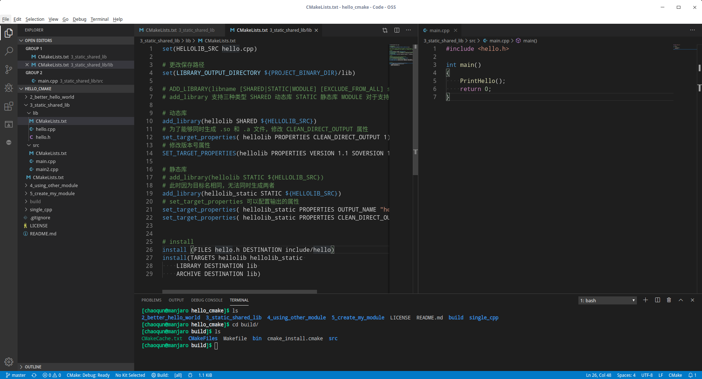
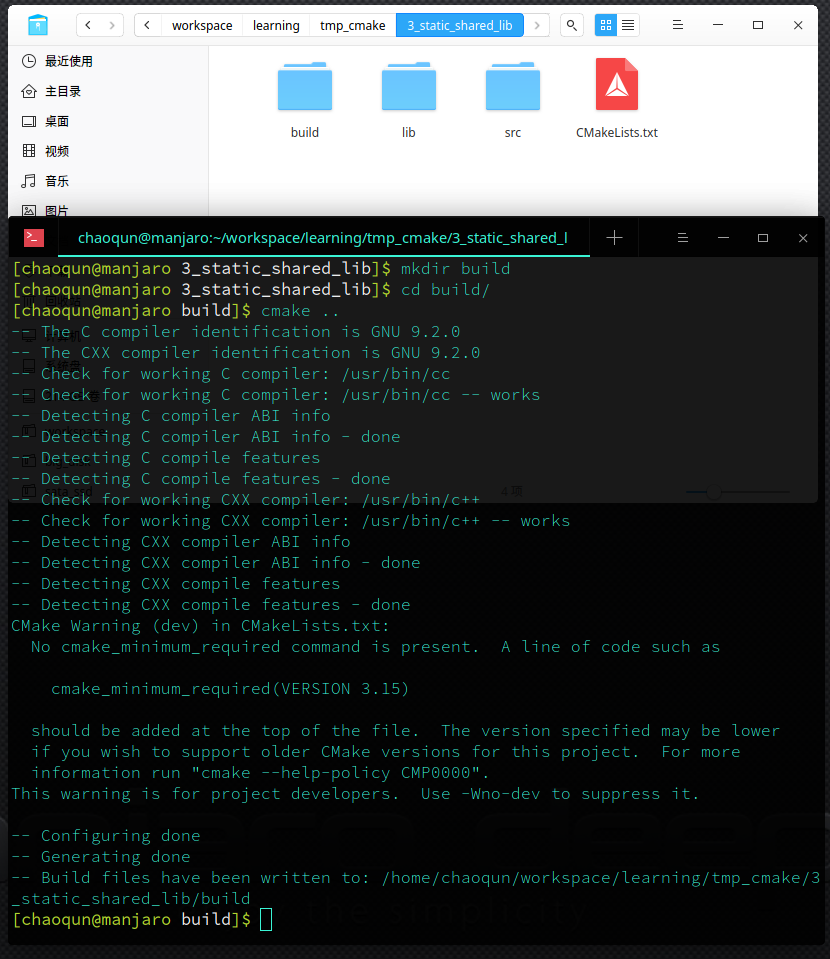

# Hello CMake： 最常用的 CMAKE 用法
# CMake 
CMake是个一个开源的跨平台自动化建构系统，用来管理软件建置的程序，并不依赖于某特定编译器，并可支持多层目录、多个应用程序与多个库。 它用配置文件控制建构过程（build process）的方式和Unix的make相似，只是CMake的配置文件取名为CMakeLists.txt。CMake并不直接建构出最终的软件，而是产生标准的建构档（如Unix的Makefile或Windows Visual C++的projects/workspaces），然后再依一般的建构方式使用。

在Linux上，`CMake` 通过 `CMakeLists.txt` 用相较 `Makefile` 更简单的语法生成 `Makefile`，之后使用 `make` 命令进行编译，`make install` 命令进行安装。

`Make` 工具除了 CMake 还有个比较好用的的管理 QT 工程的叫做 `qmake`，`qmake` 在学习的难度上相较 `CMake`要小的多，并且有轻量级的IDE `QT Creator`可以方便进行管理，关于 `qmake` 的使用，我会在后续的博客更新中讲解。

下面我来为大家介绍下我们在使用 CMake 时最常用的管理方式。

## 个人如何在 linux 使用 CMake 管理工程
一般没有针对CMake的IDE，我们可以纯手敲，它有点儿像是在写代码，稍微容易点。我通常使用 `VSCode`或者`ATOM`等编译器，直接打开工程的根目录，然后便可以看到文件夹下的源代码文件，并且还可以比较简单美观的写代码。



## 内部构建和外部构建，选择哪个？
cmake 在执行时，会生产大量临时文件，如果直接在代码根目录执行`cmake .`命令，相信会看到比代码本身更多的临时文件。


如上图，所有的临时文件直接出现在代码源文件夹，非常的不美观，而解决这种情况，一般的操作是**外部构建**。

外部构建，通过在源文件夹外创建一个新的用于放置编译中间文件的文件夹，所有生成的工程管理临时文件、编译临时文件、编译最终生成文件都在该文件夹中。
一般情况下外部构建的操作如下：

```
mkdir build # 创建一个新文件夹
cd ./build  # 进入该文件夹路径
cmake ..    # 构建工程管理临时文件
make        # 编译
make install    # 安装编译好的工程到指定路径
```


如上图，所有的临时文件都放置的在 build 文件夹中，如果需要调整，直接将 build 删除即可。对于版本管理工具`git`来讲，可以直接在`.gitignore`文件中加入一行`build/`以屏蔽对 build 文件夹的版本控制。build 文件夹内生成的文件如下图所示。


# Hello，CMake
那么如何写一个 最初的 `CMake` 管理的程序呢？

一般现代 Linux 操作系统都是自带 `CMake, gcc, make` 的，因为这也正是很多 Linux 开源软件所必须的。
我们现在来编写一个简易的 CMake 生成可执行程序的工程，本例子在各种常用的 linux 发行版中都可以使用，不管是 `ubuntu, centos, deepin, manjaro` 都可以。

> 我使用的是 manjaro 操作系统，安装了 CMake 插件的 VS Code 编辑器。

## 新建工程结构
第一步，我们新建一个空白文件夹`hello_cmake`，然后用 VS Code 打开该文件夹。

创建一个简单的工程，一共三个源文件，分别是`main.cpp`，`hello.h`,`hello.cpp`。
文件的内容如下：

```cpp
/// hello.h
# pragma once

void PrintHello();

/// hello.cpp
# include "hello.h"
#include <iostream>

using namespace std;

void PrintHello( )
{
    cout << "Hello CMake!" << endl;
}

/// main.cpp
#include "hello.h"

int main()
{
    PrintHello();
    return 0;
}
```

非常简洁的三个源文件，我们让 main 文件引用 hello.h 中声明的、定义在 hello.cpp中的函数

## 编辑 CMakeLists.txt
接着，在目录中新建一个 CMake 工程文件，文件名为 `CMakeLists.txt`，文件名不要写错，否则可能会找不到文件。

CMakeLists.txt中填写如下内容：

```CMake
# 工程名，可以随便起
project(HELLO_CMAKE)    

# 设置工程编译好的可执行文件放在输出文件夹的那个路径里
# 此处设置的是输出路径下 xxx/bin 文件夹中
set(EXECUTABLE_OUTPUT_PATH ${PROJECT_BINARY_DIR}/bin)

# 设置导出可执行程序，这里起名为 hello，
# 可执行程序的名称与工程名无关，一个工程可以编译出多个可执行程序
add_executable(hello main.cpp hello.cpp)
```

## 编译工程
通常情况下，我们采用外部构建的方法编译我们的程序，这样可以使得源文件与目标文件及各类中间文件分离，使工程路径更干净些。

```
mkdir build
cd build
cmake ..
make
```

如果你执行了上述的代码，可能会见到如下的输出

```
[chaoqun@manjaro hello_cmake]$ cd hello_cmake/
[chaoqun@manjaro hello_cmake]$ ls
CMakeLists.txt  hello.cpp  hello.h  main.cpp
[chaoqun@manjaro hello_cmake]$ mkdir build
[chaoqun@manjaro hello_cmake]$ cd build/
[chaoqun@manjaro build]$ ls
[chaoqun@manjaro build]$ cmake ..
-- The C compiler identification is GNU 9.2.0
-- The CXX compiler identification is GNU 9.2.0
-- Check for working C compiler: /usr/bin/cc
-- Check for working C compiler: /usr/bin/cc -- works
-- Detecting C compiler ABI info
-- Detecting C compiler ABI info - done
-- Detecting C compile features
-- Detecting C compile features - done
-- Check for working CXX compiler: /usr/bin/c++
-- Check for working CXX compiler: /usr/bin/c++ -- works
-- Detecting CXX compiler ABI info
-- Detecting CXX compiler ABI info - done
-- Detecting CXX compile features
-- Detecting CXX compile features - done
-- Configuring done
-- Generating done
-- Build files have been written to: /home/chaoqun/workspace/learning/hello_cmake/hello_cmake/build
[chaoqun@manjaro build]$ make
Scanning dependencies of target hello
[ 33%] Building CXX object CMakeFiles/hello.dir/main.cpp.o
[ 66%] Building CXX object CMakeFiles/hello.dir/hello.cpp.o
[100%] Linking CXX executable bin/hello
[100%] Built target hello
[chaoqun@manjaro build]$ ls
CMakeCache.txt  CMakeFiles  Makefile  bin  cmake_install.cmake
[chaoqun@manjaro build]$ ./bin/hello 
Hello CMake!
```
至此，我们便编译好了一个最简单的 CMake 工程。

# 生成可执行文件
# 生成链接库
# 引用其他链接库
# 设置安装方式
# Reference
1. [代码样例](https://github.com/Code-Freedom/hello_cmake)
2. [CMake Partice](http://file.ncnynl.com/ros/CMake%20Practice.pdf)
3. [Wikipedia](https://zh.wikipedia.org/wiki/CMake)
