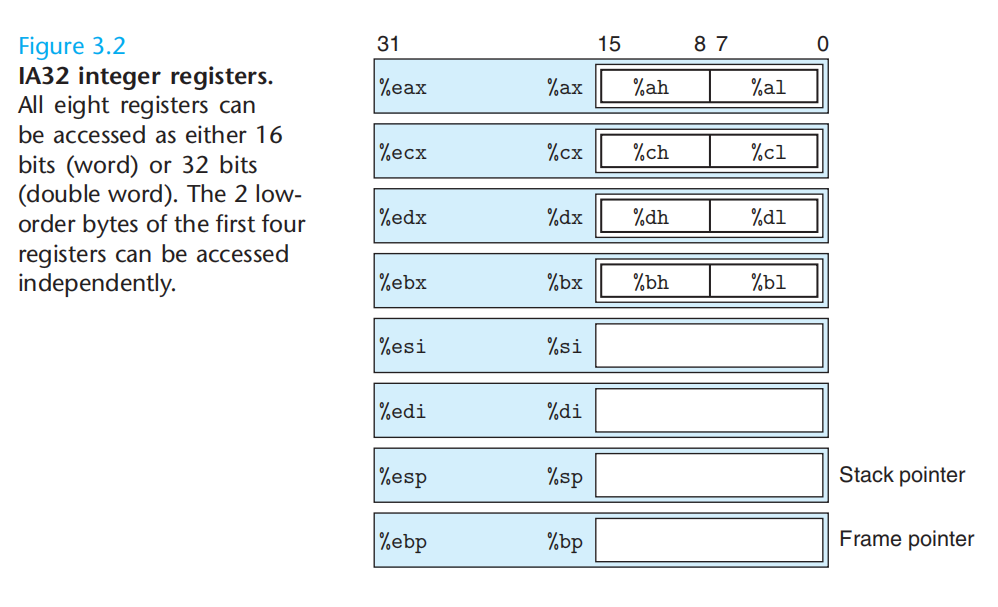
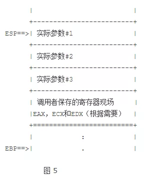

# 操作系统

## 编译
UNIX上编译一个c语言程序使用如下命令生成可执行文件`gcc -o hello hello.c`

编译系统分为预处理器(preprocessor)、编译器(compiler)、汇编器(assembler)和链接器(linker)四个部分组成。

1. 预处理阶段：预处理器（cpp）将根据以字符 '#' 开始的命令修改原始的C语言程序，得到另一个C语言程序，通常以`.i`作为文件后缀，例如`hello.i`；
2. 编译阶段：编译器（ccl）将文本文件`hello.i`翻译成文本文件`hello.s`，包含一个汇编语言程序。
3. 汇编阶段：汇编器（as）将`hello.s`翻译成机器语言指令，并把指令打包成一种可重定位目标程序（relocatable object program）的格式，并将结果保存在目标文件`hello.o` 中。
4. 链接阶段：链接器（ld）负责将一些已经存在于标准库中的目标文件合并到同一个文件中去(假设printf 函数存在于printf.o单独预编译好的目标文件中)，生成一个可执行目标文件`hello`。

## 了解编译系统如何工作带来的益处
1. 优化程序性能；
2. 理解链接时出现的错误；
3. 避免安全漏洞；

## 操作系统管理硬件
操作系统两个基本功能：
1. 防止硬件被失控的应用程序滥用；
2. 向应用程序提供简单一致的抽象机制来控制复杂而又通常不同的硬件外设；

操作系统通过提供（进程、虚拟存储器、文件）几个基本抽象概念来实现这两个功能。

# C 语言栈调用方式

IA32和x86-64的寄存器的名称及数量不一致，IA32有8个寄存器，x86-64有16个寄存器，IA32的寄存器`%ESP`用来做栈指针寄存器，指向栈顶，`%EBP`作为基准地址，指向栈帧开始；x86-64用`%rsp`做栈指针寄存器，指向栈顶，`%rbp`几乎不作为栈帧指针使用。栈的增长方向是向内存地址更小的方向增长，及新push的元素应该是`%rsp-8`此类的。

**X86-64** 的寄存器功能分类：
1. %rax 作为函数返回值使用；
2. %rsp 栈指针寄存器，指向栈顶；
3. %rdi，%rsi，%rdx，%rcx，%r8，%r9 用作函数参数，依次对应第1参数，第2参数，...；
4. %rbx，%rbp，%r12，%r13，%14，%15 用作数据存储，遵循被调用者使用规则；
5. %r10，%r11 用作数据存储，遵循调用者使用规则；
6. 按照惯例`%rbx`、`%rbp`和`%r12-%r15`被划分为被调用者保存寄存器（Callee saved），即过程P调用了过程Q，则Q应该保证这些寄存器过程前后的值不会发生改变；其余的寄存器除了`%rsp`为调用者保存寄存器（Caller saved），即过程P在调用其他程序前应该保存这些寄存器的值在内存中，以免其他过程更改了寄存器的值导致出现bug。

**IA32** 的寄存器功能分类
1. %esp 作为栈指针寄存器，指向栈顶；
2. %ebp 作为帧指针寄存器，可以理解为基准指针，传递到被调用函数（callee）的参数以及被调用函数本身申请的局部变量都可以用帧指针寄存器加减偏移量找到；
3. %eax，%ecx,%edx 被划分为调用者保存寄存器；
4. %ebx，%esi,%edi 被划分为被调用者保存寄存器；

从下面`IA32`和`x86-64`的寄存器对比上可以看到，x86-64的寄存器是在IA32的基础上扩充到64位，前缀从`e`换成了`r`，并且增加了8个寄存器`%r8-%r15`。

IA32寄存器的名称及注释

x86-64寄存器的名称及注释

## X86-64 与 IA32 在寄存器上的一些差别
1. x86-64 寄存器的大小是64位8字节； IA32是32位4字节；
2. x86-64 寄存器数量有16个； IA32寄存器数量有8个；
3. x86-64 有6个寄存器可以用来函数传参，多余的参数（从第7个参数开始）通过栈进行传参； IA32寄存器数量少，全部通过栈进行传参（参数是倒序进展，因此第一个参数是%ebp+4，第二个参数是%ebp+8，%ebp存储的是上一个%ebp的地址）；
4. IA32有栈帧指针 %ebp，在x86-64中，扩充而来的%rbp基本不作为栈帧指针使用，而是另做他途。在IA32时代，当前栈帧总是从保存%ebp开始，空间由运行时决定，通过不断push和pop改变当前栈帧空间；x86-64开始，GCC有了新的选择，优化编译选项-O1，可以让GCC不再使用栈帧指针，下面引用 gcc manual 一段话 ：
> -O also turns on -fomit-frame-pointer on machines where doing so does not interfere with debugging.
这样一来，所有空间在函数开始处就预分配好，不需要栈帧指针；通过%rsp的偏移就可以访问所有的局部变量。

5. 从调用的函数P中传递参数给被调用函数Q的参数，属于函数P的栈帧。
6. x86-64 用 %rax 保存大小小于等于8字节的返回值，如果超过大小，则指向保存返回值的地址； IA32使用 %eax 保存大小小于等于4个字节的返回值，如果大于4字节小于等于8字节，则%edx也会被用来保存返回值，如果返回值占用的空间还要大，那么调用者会向被调用者传递一个额外参数，这个额外参数指向将要保存返回值的地址。

## 函数调用时栈的变换
### 函数调用时调用者的操作
1. 首先，调用者P将自己使用了的调用者保存寄存器的值压栈保存，防止被接下来调用了的函数Q修改。（可选，如果没有使用这些寄存器，则不需要操作）
2. P把传递给Q的参数加入参数寄存器，多出来的入栈保存；
3. 使用 `call Q` 调用子函数；
4. call 命令执行的时候，将返回地址（地址A）压入栈，并将程序计数器PC设置为过程Q的起始地址。对应的ret会pop 地址A，然后将 PC 改回地址A。

如图所示，是ia32的栈变换的效果

### 被调用者在函数调用后的动作
1. 建立自己的栈帧，因为当前%ebp正指向调用函数P的栈帧开始，所以将栈帧指针%ebp进栈保存，并修改%ebp的值为%esp，使得函数的参数可以通过%ebp和偏移量寻找到，而栈顶指针 %rsp可以用来分配其他空间；`push %ebp; mov %ebp, %esp;`
2. 为函数自己的局部变量分配空间，通过减小%esp的值，分配新的空间；
3. 如果函数Q用到了调用者保存寄存器（Caller saved），则需要先将该寄存器入栈保存，并在函数结束前恢复寄存器的值；

如图所示，是ia32的栈变换的效果

### 被调用者返回前的动作
1. 将返回值保存在返回值寄存器`%eax %rax`中；
2. 恢复调用者保存寄存器的值；
3. 释放局部变量，之后恢复栈帧`mov esp, ebp; pop ebp;`
4. 执行 ret 命令，将PC程序计数器改回地址A，继续执行过程P接下来的内容；

如图所示，是ia32的栈变换的效果

### 调用者在返回后的操作
1. 将传递给过程Q的参数出栈；
2. 恢复被调用者保存寄存器的值，出栈；
3. 继续执行；

## Reference
1. [你一定要搞明白的C函数调用方式与栈原理](https://mp.weixin.qq.com/s?__biz=MzU2MTkwMTE4Nw==&mid=2247486799&amp;idx=1&amp;sn=dcf7602b48a383d2d5cafcd6688d0445&source=41#wechat_redirect)
2. [CSAPP:3rd]()
