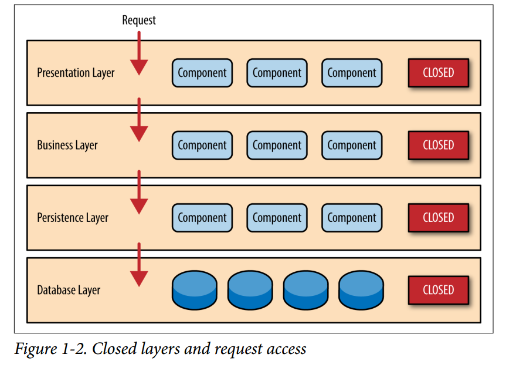
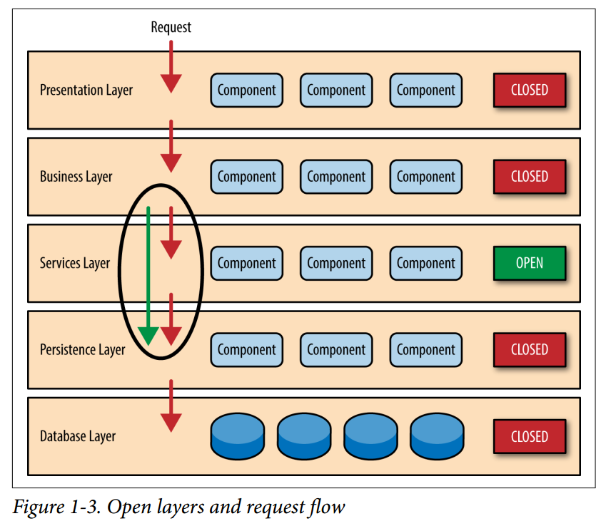
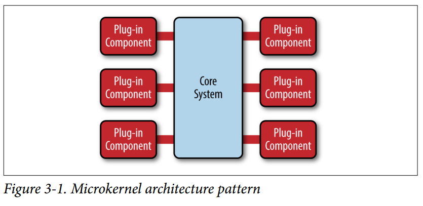
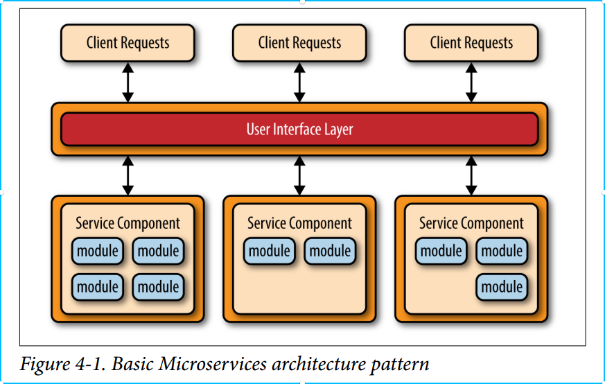
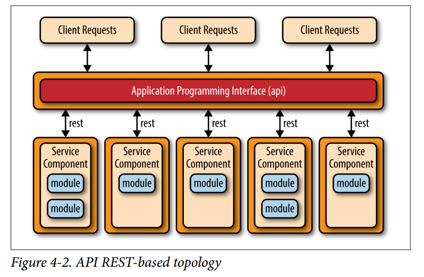
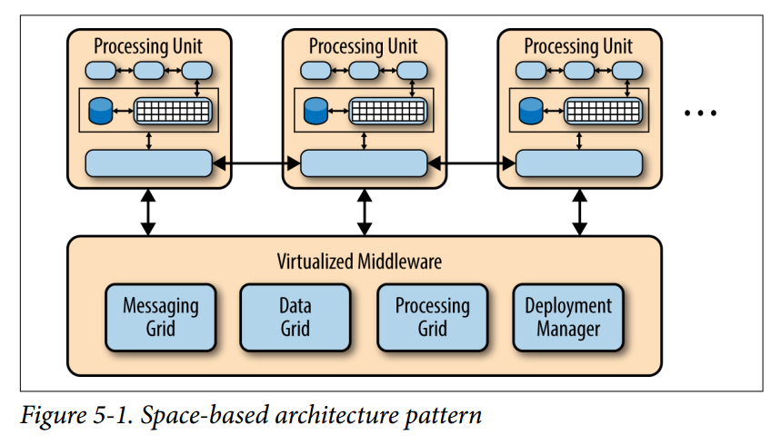
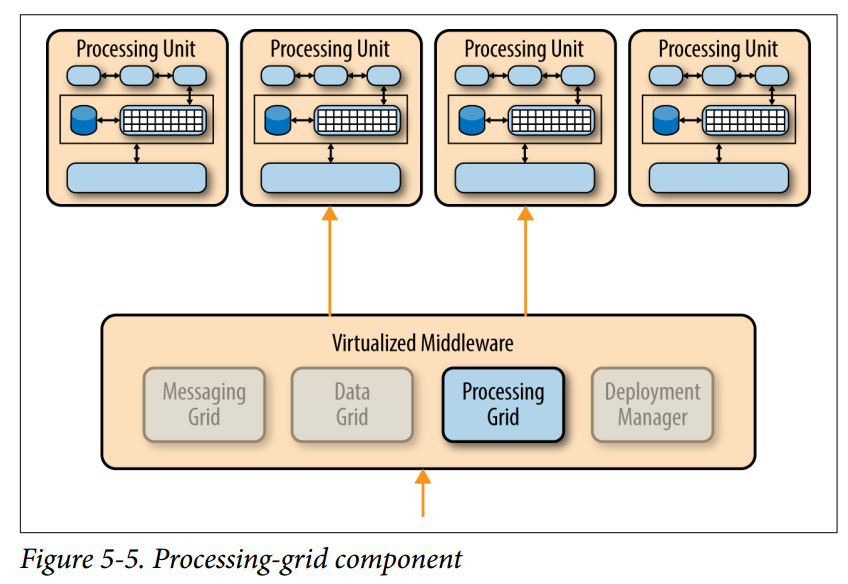

# 软件架构模式

## Layered Architecture 多层架构

在软件工程中，多层架构是一种客户端/服务器端架构。在该架构中，表现功能、应用处理和数据管理功能物理分离。最常使用的多层架构是三层架构。

多层架构提供了一种模型，使得开发者可以建立方便扩展和复用的应用。通过将应用分成多层，开发者拥有修改或增加一个特定层的选择，而不是重写整个应用。一个三层架构通常由**表现层，业务逻辑层和数据存储层**组成。

## Event-Driven Architecture 事件驱动架构

## Microkernel Architecture 微内核架构
微核心的设计理念，是将系统服务的实现，与系统的基本操作规则区分开来。它实现的方式，是将核心功能模块化，划分成几个独立的行程，各自运行，这些行程被称为服务（service）。所有的服务行程，都运行在不同的地址空间。只有需要绝对特权的行程，才能在具特权的运行模式下运行，其余的行程则在用户空间运行。

这样的设计，使内核中最核心的功能，设计上变的更简单。需要特权的行程，只有基本的线程管理，内存管理和进程间通信等，这个部分，由一个简单的硬件抽象层与关键的系统调用组成。其余的服务行程，则移至用户空间。

让服务各自独立，可以减少系统之间的耦合度，易于实现与调试，也可增进可移植性。它可以避免单一组件失效，而造成整个系统崩溃，内核只需要重启这个组件，不致于影响其他服务器的功能，使系统稳定度增加。同时，操作系统也可以视需要，抽换或新增某些服务行程，使功能更有弹性。

因为所有服务行程都各自在不同地址空间运行，因此在微核心架构下，不能像宏内核一样直接进行函数调用。在微核心架构下，要创建一个行程间通信机制，通过消息传递的机制来让服务行程间相互交换消息，调用彼此的服务，以及完成同步。采用主从式架构，使得它在分布式系统中有特别的优势，因为远程系统与本地行程间，可以采用同一套行程间通信机制。

但是因为行程间通信耗费的资源与时间，比简单的函数调用还多；通常又会涉及到核心空间到用户空间的环境切换（context switch）。这使得消息传递有延迟，以及传输量（throughput）受限的问题，因此微核心在通信宽容度不足下，可能出现性能不佳的问题。

就代码数量来看，一般来说，因为功能简化，微核心使用的代码比集成式核心更少，其源代码通常小于10,000行。例如，MINIX 3的源代码少于6,000行。更少的代码，也代表更少的潜藏程序bug，对于重视安全性的人来说会较为偏好。

## Microservices Architecture Pattern 微服务架构模式

微服务是一种以业务功能为主的服务设计概念，每一个服务都具有自主运行的业务功能，对外开放不受语言限制的 API (最常用的是 HTTP)，应用程序则是由一个或多个微服务组成。

微服务的另一个对比是单体式应用程序。单体式应用表示一个应用程序内包含了所有需要的业务功能，并且使用像主从式架构 (Client/Server) 或是多层次架构 (N-tier) 实现，虽然它也是能以分布式应用程序来实现，但是在单体式应用内，每一个业务功能是不可分割的。若要对单体式应用进行扩展则必须将整个应用程序都放到新的运算资源（如：虚拟机） 内，但事实上应用程序中最吃资源、需要运算资源的仅有某个业务部分（例如跑分析报表或是数学算法分析），但因为单体式应用无法分割该部分，因此无形中会有大量的资源浪费的现象。

微服务运用了以业务功能的设计概念，应用程序在设计时就能先以业务功能或流程设计先行分割，将各个业务功能都独立实现成一个能自主运行的个体服务，然后再利用相同的协议将所有应用程序需要的服务都组合起来，形成一个应用程序。若需要针对特定业务功能进行扩展时，只要对该业务功能的服务进行扩展就好，不需要整个应用程序都扩展，同时，由于微服务是以业务功能导向的实现，因此不会受到应用程序的干扰，微服务的管理员可以视运算资源的需要来配置微服务到不同的运算资源内，或是布建新的运算资源并将它配置进去。

虽然使用一般的服务器虚拟化技术就能应用于微服务的管理，但容器技术 (Container Technology) 如 Docker 会更加地适合发展微服务的运算资源管理技术。

## Space-Based Architecture 基于空间的架构
一种软件体系结构模式，用于使用元组空间范例实现有状态的高性能应用程序的线性可伸缩性。它遵循表示状态转移（REST），面向服务的体系结构（SOA）和事件驱动的体系结构（EDA）的许多原理，以及网格计算的元素。利用基于空间的体系结构，应用程序由一组称为处理单元（PU）的自给单元构建而成。这些单位彼此独立，因此应用程序可以通过添加更多单位来扩展。SBA模型与其他成功解决了应用程序可扩展性挑战的模式密切相关，例如Google，Amazon.com和其他知名公司使用的无共享架构（SN）。该模型也已被证券行业的许多公司用于实现可扩展的电子证券交易应用程序。

