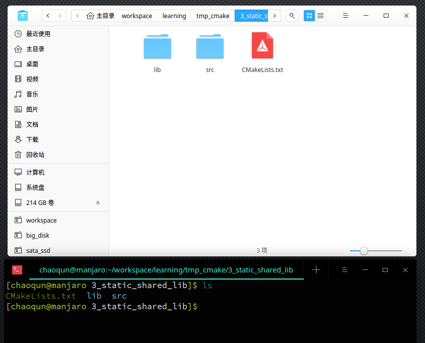
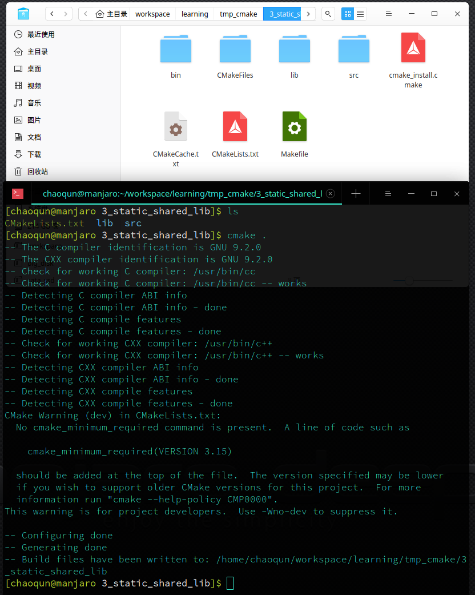
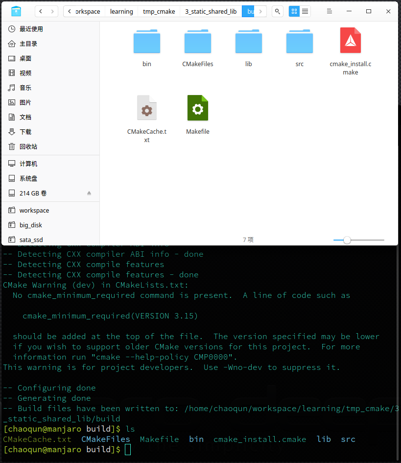

# GCC

## 编译过程

UNIX上编译一个c语言程序使用如下命令生成可执行文件`gcc -o hello hello.c`

编译系统分为预处理器(preprocessor)、编译器(compiler)、汇编器(assembler)和链接器(linker)四个部分组成。

1. **预处理阶段**：预处理器（cpp）将根据以字符 '#' 开始的命令修改原始的C语言程序，得到另一个C语言程序，通常以`.i`作为文件后缀，例如`hello.i`；
2. **编译阶段**：编译器（ccl）将文本文件`hello.i`翻译成文本文件`hello.s`，包含一个汇编语言程序。
3. **汇编阶段**：汇编器（as）将`hello.s`翻译成机器语言指令，并把指令打包成一种可重定位目标程序（relocatable object program）的格式，并将结果保存在目标文件`hello.o` 中。
4. **链接阶段**：链接器（ld）负责将一些已经存在于标准库中的目标文件合并到同一个文件中去(假设printf 函数存在于printf.o单独预编译好的目标文件中)，生成一个可执行目标文件`hello`。

## CMake

CMake是个一个开源的跨平台自动化建构系统，用来管理软件建置的程序，并不依赖于某特定编译器，并可支持多层目录、多个应用程序与多个库。 它用配置文件控制建构过程（build process）的方式和Unix的make相似，只是CMake的配置文件取名为CMakeLists.txt。CMake并不直接建构出最终的软件，而是产生标准的建构档（如Unix的Makefile或Windows Visual C++的projects/workspaces），然后再依一般的建构方式使用。

在Linux上，`CMake` 通过 `CMakeLists.txt` 用相较 `Makefile` 更简单的语法生成 `Makefile`，之后使用 `make` 命令进行编译，`make install` 命令进行安装。

`Make` 工具除了 CMake 还有个比较好用的的管理 QT 工程的叫做 `qmake`，`qmake` 在学习的难度上相较 `CMake`要小的多，并且有轻量级的IDE `QT Creator`可以方便进行管理，关于 `qmake` 的使用，我会在后续的博客更新中讲解。

下面我来为大家介绍下我们在使用 CMake 时最常用的管理方式。

## 个人如何在 linux 使用 CMake 管理工程

一般没有针对CMake的IDE，我们可以纯手敲，它有点儿像是在写代码，稍微容易点。我通常使用 `VSCode`或者`ATOM`等编译器，直接打开工程的根目录，然后便可以看到文件夹下的源代码文件，并且还可以比较简单美观的写代码。


## 内部构建和外部构建，选择哪个

cmake 在执行时，会生产大量临时文件，如果直接在代码根目录执行`cmake .`命令，相信会看到比代码本身更多的临时文件。





如上图，所有的临时文件直接出现在代码源文件夹，非常的不美观，而解决这种情况，一般的操作是**外部构建**。

外部构建，通过在源文件夹外创建一个新的用于放置编译中间文件的文件夹，所有生成的工程管理临时文件、编译临时文件、编译最终生成文件都在该文件夹中。
一般情况下外部构建的操作如下：

```bash
mkdir build # 创建一个新文件夹
cd ./build  # 进入该文件夹路径
cmake ..    # 构建工程管理临时文件
make        # 编译
make install    # 安装编译好的工程到指定路径
```


如上图，所有的临时文件都放置的在 build 文件夹中，如果需要调整，直接将 build 删除即可。对于版本管理工具`git`来讲，可以直接在`.gitignore`文件中加入一行`build/`以屏蔽对 build 文件夹的版本控制。build 文件夹内生成的文件如下图所示。



## Hello，CMake

那么如何写一个 最初的 `CMake` 管理的程序呢？

一般现代 Linux 操作系统都是自带 `CMake, gcc, make` 的，因为这也正是很多 Linux 开源软件所必须的。
我们现在来编写一个简易的 CMake 生成可执行程序的工程，本例子在各种常用的 linux 发行版中都可以使用，不管是 `ubuntu, centos, deepin, manjaro` 都可以。

> 我使用的是 manjaro 操作系统，安装了 CMake 插件的 VS Code 编辑器。

### 新建工程结构

第一步，我们新建一个空白文件夹`hello_cmake`，然后用 VS Code 打开该文件夹。

创建一个简单的工程，一共三个源文件，分别是`main.cpp`，`hello.h`,`hello.cpp`。
文件的内容如下：

```cpp
/// hello.h
# pragma once

void PrintHello();

/// hello.cpp
# include "hello.h"
#include <iostream>

using namespace std;

void PrintHello( )
{
    cout << "Hello CMake!" << endl;
}

/// main.cpp
#include "hello.h"

int main()
{
    PrintHello();
    return 0;
}
```

非常简洁的三个源文件，我们让 main 文件引用 hello.h 中声明的、定义在 hello.cpp中的函数

### 编辑 CMakeLists.txt

接着，在目录中新建一个 CMake 工程文件，文件名为 `CMakeLists.txt`，文件名不要写错，否则可能会找不到文件。

CMakeLists.txt中填写如下内容：

```CMake
# 工程名，可以随便起
project(HELLO_CMAKE)

# 设置工程编译好的可执行文件放在输出文件夹的那个路径里
# 此处设置的是输出路径下 xxx/bin 文件夹中
set(EXECUTABLE_OUTPUT_PATH ${PROJECT_BINARY_DIR}/bin)

# 设置导出可执行程序，这里起名为 hello，
# 可执行程序的名称与工程名无关，一个工程可以编译出多个可执行程序
add_executable(hello main.cpp hello.cpp)
```

### 编译工程

通常情况下，我们采用外部构建的方法编译我们的程序，这样可以使得源文件与目标文件及各类中间文件分离，使工程路径更干净些。

```bash
mkdir build
cd build
cmake ..
make
```

如果你执行了上述的代码，可能会见到如下的输出

```bash
[chaoqun@manjaro hello_cmake]$ cd hello_cmake/
[chaoqun@manjaro hello_cmake]$ ls
CMakeLists.txt  hello.cpp  hello.h  main.cpp
[chaoqun@manjaro hello_cmake]$ mkdir build
[chaoqun@manjaro hello_cmake]$ cd build/
[chaoqun@manjaro build]$ ls
[chaoqun@manjaro build]$ cmake ..
-- The C compiler identification is GNU 9.2.0
-- The CXX compiler identification is GNU 9.2.0
-- Check for working C compiler: /usr/bin/cc
-- Check for working C compiler: /usr/bin/cc -- works
-- Detecting C compiler ABI info
-- Detecting C compiler ABI info - done
-- Detecting C compile features
-- Detecting C compile features - done
-- Check for working CXX compiler: /usr/bin/c++
-- Check for working CXX compiler: /usr/bin/c++ -- works
-- Detecting CXX compiler ABI info
-- Detecting CXX compiler ABI info - done
-- Detecting CXX compile features
-- Detecting CXX compile features - done
-- Configuring done
-- Generating done
-- Build files have been written to: /home/chaoqun/workspace/learning/hello_cmake/hello_cmake/build
[chaoqun@manjaro build]$ make
Scanning dependencies of target hello
[ 33%] Building CXX object CMakeFiles/hello.dir/main.cpp.o
[ 66%] Building CXX object CMakeFiles/hello.dir/hello.cpp.o
[100%] Linking CXX executable bin/hello
[100%] Built target hello
[chaoqun@manjaro build]$ ls
CMakeCache.txt  CMakeFiles  Makefile  bin  cmake_install.cmake
[chaoqun@manjaro build]$ ./bin/hello
Hello CMake!
```

至此，我们便编译好了一个最简单的 CMake 工程。

## 如何让自己的 CMake 工程支持 make install 命令

CMake 程序的安装通常分为两种，第一种是直接发布给用户源码，用户编译后直接使用 `make install` 命令安装到自己的电脑指定位置；第二种便是开发者将编译好的程序打包给用户，用户用包管理器安装到自己的电脑中。这里我为大家介绍第一种方式。

### INSTALL 命令

CMake 有Install命令，可以配合 make install 使用，install的形式如下：

```cmake
install(TARGETS targets... [EXPORT <export-name>]
          [[ARCHIVE|LIBRARY|RUNTIME|FRAMEWORK|BUNDLE|
            PRIVATE_HEADER|PUBLIC_HEADER|RESOURCE]
                [DESTINATION <dir>]
                [PERMISSIONS permissions...]
                [CONFIGURATIONS [Debug|Release|...]]
                [COMPONENT <component>]
                [OPTIONAL] [NAMELINK_ONLY|NAMELINK_SKIP]
          ] [...])
```

最常用的參數是 DESTINATION，用以指定安裝的目的地。假如我們生成一个可执行程序 hello，install() 指令通常寫起來像這樣：

```cmake
add_executable(hello main.cpp hello.cpp)
install(TARGETS hello DESTINATION bin)
```

### 那么实际使用 `make install` 命令时软件安装到了哪个路径呢

在 windows 操作系统下，软件会安装到 `C:\Program Files\`，在 Linux、MacOS等操作系统下，则会安装到`/usr/local/`下。

我们可以通过设置CMake内置变量`CMAKE_INSTALL_PREFIX`的值来指定一个安装前缀，这个变量可以在`CMakeLists.txt`文件内设置，也可以不设置。如果不设置，我们在构建CMAKE工程时可以手动指定，通过`cmake ../project_path -DCMAKE_INSTALL_PRFIX=./install`，则安装的路径会在当前文件夹下的新建文件夹`install`文件夹下。

除了 CMAKE_INSTALL_PREFIX 之外，CMake 所產生出來的 Makefile 也支持 DESTDIR 变量。有下面兩種使用方式：

```bash
make install DESTDIR="/some/absolute/path"
或
export DESTDIR="/some/absolute/path"
make install
```

如此一来，最后的保存文件位置便为：

```plain
    -DESTDIR/
        -CMAKE_INSTALL_PREFIX/
            -install 指定的 DESTINATION
```

### 实践

在前一篇文章中，我们实现了一个第一个 CMake 工程，我们编辑该工程的`CMakeLists.txt`文件，使文件内容如下：

```cmake
project(HELLO_CMAKE)

set(EXECUTABLE_OUTPUT_PATH ${PROJECT_BINARY_DIR}/bin)

add_executable(hello main.cpp hello.cpp)

install(TARGETS hello DESTINATION bin)
```

然后我们重新构建工程，可能会见到如下的输出：

```sh
chaoqun@manjaro hello_cmake]$ ls
CMakeLists.txt  build  hello.cpp  hello.h  main.cpp
[chaoqun@manjaro hello_cmake]$ cd build/
[chaoqun@manjaro build]$ cmake .. -DCMAKE_INSTALL_PREFIX=./install
CMake Warning (dev) in CMakeLists.txt:
  No cmake_minimum_required command is present.  A line of code such as

    cmake_minimum_required(VERSION 3.15)

  should be added at the top of the file.  The version specified may be lower
  if you wish to support older CMake versions for this project.  For more
  information run "cmake --help-policy CMP0000".
This warning is for project developers.  Use -Wno-dev to suppress it.

-- Configuring done
-- Generating done
-- Build files have been written to: /home/chaoqun/workspace/learning/hello_cmake/hello_cmake/build
[chaoqun@manjaro build]$ make
Scanning dependencies of target hello
[ 33%] Building CXX object CMakeFiles/hello.dir/main.o
[ 66%] Building CXX object CMakeFiles/hello.dir/hello.o
[100%] Linking CXX executable bin/hello
[100%] Built target hello
[chaoqun@manjaro build]$ make install
[100%] Built target hello
Install the project...
-- Install configuration: ""
-- Installing: /home/chaoqun/workspace/learning/hello_cmake/hello_cmake/build/install/bin/hello
chaoqun@manjaro build]$ ls
CMakeCache.txt  Makefile  cmake_install.cmake  install_manifest.txt
CMakeFiles      bin       install
[chaoqun@manjaro build]$ cd install/
[chaoqun@manjaro install]$ ls
bin
[chaoqun@manjaro install]$ cd bin/
[chaoqun@manjaro bin]$ ls
hello
[chaoqun@manjaro bin]$ ./hello
Hello CMake!
```

由此可见，我们成功把文件安装到了自己想要放置的路径，如果想要安装到系统目录下，可以通过设置`CMAKE_INSTALL_PREFIX`的值为`/usr/`；那样 hello 文件会被放置到`/usr/bin/`文件夹下，而`/usr/bin/`是系统默认环境变量`PATH`中的一部分。需要注意的是，安装到系统变量里通常需要使用`root`权限，否则可能不具有写入该路径的权限。

### install 支持的安装的文件种类

install 不止可以安装可执行程序，也支持更多种类：

- TARGETS   将 make 编译出来的文件复制到指定文件夹
- FILES     将一般的文件复制到指定文件夹
- DIRECTORY 将一个目录内的内容复制到指定文件夹

```cmake
install(FILES files...
    DESTINATION <dir>
    [PERMISSIONS permissions...]
    [CONFIGURATIONS [Debug|Release|...]]
    [COMPONENT <component>]
    [RENAME <name>] [OPTIONAL]
    )

install(DIRECTORY dirs...
    DESTINATION <dir>
    [FILE_PERMISSIONS permissions...]
    [DIRECTORY_PERMISSIONS permissions...]
    [USE_SOURCE_PERMISSIONS] [OPTIONAL]
    [CONFIGURATIONS [Debug|Release|...]]
    [COMPONENT <component>] [FILES_MATCHING]
    [[PATTERN <pattern> | REGEX <regex>]
    [EXCLUDE] [PERMISSIONS permissions...]] [...]
    )
```

如果我想把 `hello.h`复制到`include`文件夹，并把当前工程文件夹内的所有内容复制到`src`文件夹中，我们可以按如下方式修改`CMakeLists.txt`

```cmake
project(HELLO_CMAKE)

set(EXECUTABLE_OUTPUT_PATH ${PROJECT_BINARY_DIR}/bin)

add_executable(hello main.cpp hello.cpp)

# 安装 编译生成的 hello 文件到 CMAKE_INSATLL_PREFIX/bin
install(TARGETS hello DESTINATION bin)

# 复制 hello.h 文件到 CMAKE_INSATLL_PREFIX/include 文件夹中
install(FILES hello.h DESTINATION include)

# 复制整个文件夹内的文件到 CMAKE_INSATLL_PREFIX/src 文件夹中
install(DIRECTORY ${PROJECT_SOURCE_DIR} DESTINATION src)
```

最终效果如下：

```sh
[chaoqun@manjaro build]$ make
[100%] Built target hello
[chaoqun@manjaro build]$ make install
[100%] Built target hello
Install the project...
-- Install configuration: ""
-- Installing: /home/chaoqun/workspace/learning/hello_cmake/build/install/bin/hello
-- Installing: /home/chaoqun/workspace/learning/hello_cmake/build/install/include/hello.h
-- Installing: /home/chaoqun/workspace/learning/hello_cmake/build/install/src/hello_cmake
-- Installing: /home/chaoqun/workspace/learning/hello_cmake/build/install/src/hello_cmake/hello.h
-- Installing: /home/chaoqun/workspace/learning/hello_cmake/build/install/src/hello_cmake/CMakeLists.txt
-- Installing: /home/chaoqun/workspace/learning/hello_cmake/build/install/src/hello_cmake/main.cpp
-- Installing: /home/chaoqun/workspace/learning/hello_cmake/build/install/src/hello_cmake/hello.cpp
[chaoqun@manjaro build]$ ls
CMakeCache.txt  Makefile  cmake_install.cmake  install_manifest.txt
CMakeFiles      bin       install
[chaoqun@manjaro build]$ cd install/
[chaoqun@manjaro install]$ ls
bin  include  src
```

## 生成链接库

## 引用其他链接库

## 设置安装方式

## Reference

1. [代码样例](https://github.com/Code-Freedom/hello_cmake)
2. [CMake Partice](http://file.ncnynl.com/ros/CMake%20Practice.pdf)
3. [Wikipedia](https://zh.wikipedia.org/wiki/CMake)
4. [程序员的自我修养-链接、装载与库](https://item.jd.com/10067200.html)
