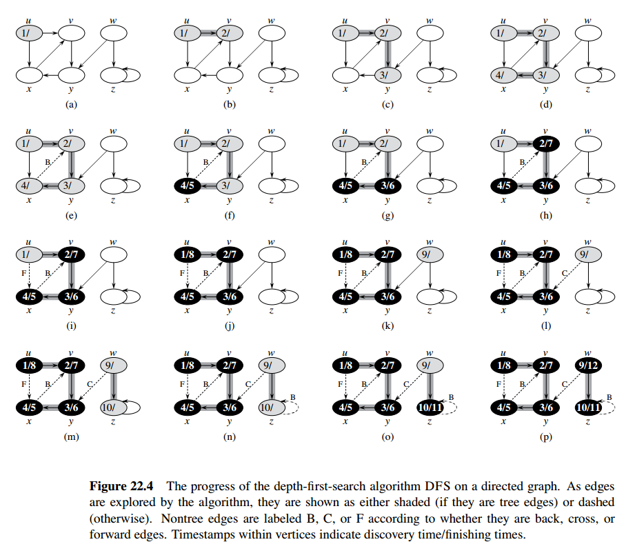
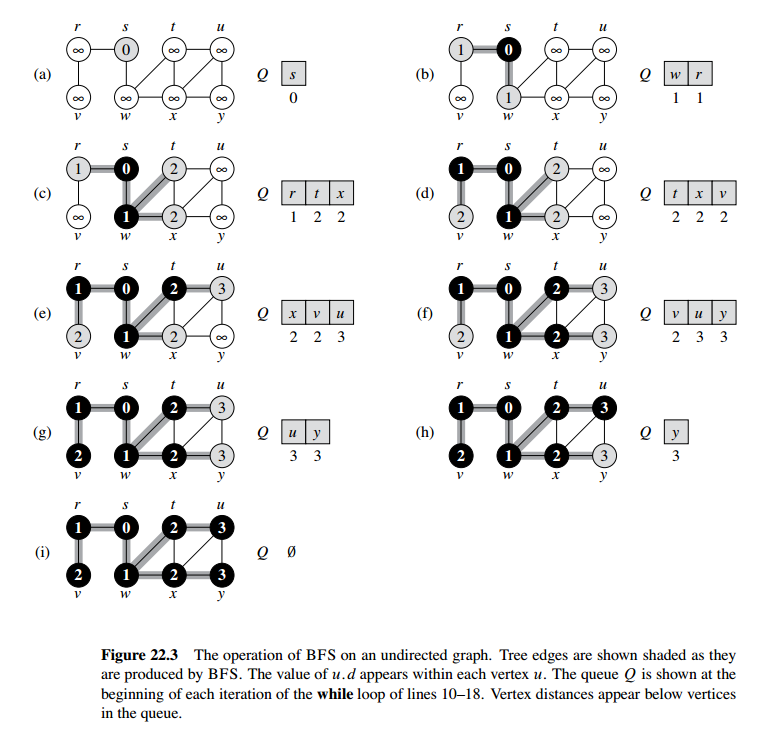

# 图

## 图的基本表示

表示一个图有两种标准方法：图邻接表和图的邻接矩阵；
邻接矩阵就是用数组(二维)表示图。具体可以看下面例子。当然，这种情况很容易造成空间浪费，所以很多人进行空间优化，甚至是邻接表的方式。


邻接表咋是数组嵌套链表，这样会比邻接矩阵省不少空间，但对无向图来说，依旧会浪费一半的空间。


在本文中，使用 `G=(V,E)` 表示一个图，V表示顶点，E表示边。

## 图的常见概念

1. **顶点=结点**；
2. **边=弧**；
3. **顶点的度**：与它关联的边的数量；
4. **出度、入度**：有向图的顶点关联的边的数量；
5. **子图**：是一张图的一部分。当我们需要对图中的特定节点，特定关系，或者特定标签或者属性进行特定分析时，子图就会很有用。
6. **路径**：一组结点及它们关系的集合。
7. **连通图与非连通图**：连通图（Connected Graphs）指图内任意两个节点间，总能找到一条路径连接它们，否则，为非连通图（Disconnected Graphs）。也就是，如果图中包含有孤立的岛，便是非连通图。
8. **加权图和非加权图**：未加权图（Unweighted Graphs）的节点和边上均没有权重。对于加权图（Weighted Graphs），所加权重可以代表：成本、时间、距离、容量、甚至是指定域的优先级。
9. **有向图和无向图**：在无向图中，顶点的关系被认为是双向的，在有向图中，顶点的关系是双向的，仅能从一个结点出发到另一个节点；
10. **非循环图和循环图**：图论中，循环指一些特殊的路径，它们的起点和终点是同一个节点。在非循环图（Acyclic Graph）中，不存在循环路径，相反则为循环图（Cyclic Graphs），有向图和无向图都可能包含循环。

## 图论的常见问题

1. 基于广度优先（BFS）和深度优先（DFS）的两种图搜索算法；
2. 判断图中是否有环
3. 拓扑排序；
4. 如何深拷贝一张图；
5. 欧拉回路（每条边经过一次且仅一次的路线）；
6. 迪杰斯特拉（Dijikstra）算法 最短路径问题；
7. 最小生成树问题；
8. 有向图中，物流的最大流量问题；
9. 邮差的最短路径问题；

## 算法整理

### 深度优先搜索

深度优先搜索属于图算法的一种，英文缩写为 DFS 即 Depth First Search .其过程简要来说是对每一个可能的分支路径深入到不能再深入为止，而且每个节点只能访问一次.

对于深度优先的流程来说，大致可以认为是这样的操作：从初始点按照一个方向搜索，直到这个方向到了尽头再回退去其他路径；他的执行像是一个栈，也像是递归；也很像是**二叉树的前序遍历**；



```python
DFS(G)
    for each vertex u belongs to G.V
        u.color = WHITE
        u.pi = NIL
    time = 0
    // 这里之所以做循环呢，是因为怕图是非连通图，可能会有遗漏的顶点
    for each vertex u belongs to G.V
        if u.color == WHITE
            DFS-VISIT(G, u)

DFS-VISIT(G, u)
    time = time+1
    u.d = time
    u.color = GRAY
    for each v belongs to G.Adj[u]  // 处理 u 的所有邻接点 v
        if v.color == WHITE
            v.pi = u
            DFS-VISIT(G, v)
    u.color = BLACK
    time - time+1
    u.f = time

```

### 广度优先搜索

BFS，其英文全称是Breadth First Search。 BFS并不使用经验法则算法。从算法的观点，所有因为展开节点而得到的子节点都会被加进一个先进先出的队列中。一般的实验里，其邻居节点尚未被检验过的节点会被放置在一个被称为 open 的容器中（例如队列或是链表），而被检验过的节点则被放置在被称为 closed 的容器中。（open-closed表）

**Prim最小生成树算法和Dijkstra单源最短路径算法都采用了类似的算法。**

个人理解，BFS算法在操作上非常像**二叉树的层次遍历**，都需要有一个队列辅助保存最近的顶点。

在给定图`G=(V, E)`和特定顶点`s`是，广度优先搜索搜索图中的边，期望发现`s`能到达的所有顶点，并计算`s`到所有顶点的距离，该算法同时能生成一棵根为`s`、包括所有`s`可到达顶点的广度优先树。对于可以从`s`到达的任意顶点`v`，广度优先树中从`s`到`v`的路径对应于图`G`中的一条最短路径，即包含最少边数的路径。



```python
BFS(G, s)
    for each vertex u belongs to G.V - {s}
        u.color = white // 未遍历过的顶点是白色
        u.d = INT_MAX
        u.pi = NIL
    s.color = GRAY
    s.d = 0
    s.pi = NIL

    Q = {}
    ENQUEUE(Q, s)       // 入队
    while(Q != {})
        u = DEQUEUE(Q)  // 出队
        for each v belongs to G.Adj[u]  // 顶点u的所有邻接点
            if v.color == WHITE
                v.color = GRAY
                v.d = u.d + 1
                v.pi = u
                ENQUEUE(Q, v)   // 将处理过的 v 入队
        u.color = BLACK         // 遍历过的顶点是黑色

```

### 判断图是否有环

#### 解法一

通过深度优先遍历解决：如果一条深度有限遍历的路径中遇到了之前访问过的结点（给每个访问的结点做标记），则证明图中存在环；

因为采用邻接矩阵存储，一般至少需要将矩阵中元素的一半给过一下，由于矩阵元素个数为n^2， 因此时间复杂度就是O(n^2)。如果采用邻接表存储，则只存储了边结点(e条边，无向图是2e条边)，加上表头结点为n（也就是顶点个数），因此时间复杂度为O(n+e)。

#### 解法二

方法是重复寻找一个入度为0的顶点，将该顶点从图中删除（即放进一个队列里存着，这个队列的顺序就是最后的拓扑排序，具体见程序），并将该结点及其所有的出边从图中删除（即该结点指向的结点的入度减1），最终若图中全为入度为1的点，则这些点至少组成一个回路。

采用邻接矩阵存储时，遍历二维数组，求各顶点入度的时间复杂度是O(n^2)。 遍历所有结点，找出入度为0的结点的时间复杂度是O(n)。对于n个入度为0的结点，删除他们的出边的复杂度为O(n^2)。 所以总的复杂度为O(n^2)。

对于邻接表，遍历所有边，求各顶点入度的时间复杂度是O(e)，即边的个数。遍历所有结点，找出入度为0的结点的时间复杂度是O(n)，即顶点的个数。遍历所有边，删除入度为0的结点的出边的复杂度为O(e)，即边的个数。所以总的时间复杂度是O(n+e)。

### 最小生成树

**prim** 算法又称为最小生成树算法。

从单一顶点开始，prim算法按照以下步骤逐步扩大树中所含顶点的数目，直到遍及连通图的所有顶点。

1. 输入：一个加权连通图，其中顶点集合为V，边集合为E；
2. 初始化：Vnew = {x}，其中x为集合V中的任一节点（起始点），Enew = {}；
3. 重复下列操作，直到Vnew = V：
   1. 在集合E中选取权值最小的边（u, v），其中u为集合Vnew中的元素，而v则是V中没有加入Vnew的顶点（如果存在有多条满足前述条件即具有相同权值的边，则可任意选取其中之一）；  
   2. 将v加入集合Vnew中，将（u, v）加入集合Enew中。
4. 输出：使用集合Vnew和Enew来描述所得到的最小生成树。

### 拓扑排序

啥叫拓扑排序？

> 将有向图中的顶点以线性方式进行排序。即对于任何连接自顶点u到顶点v的有向边uv，在最后的排序结果中，顶点u总是在顶点v的前面。

拓扑排序可以基于 DFS 实现：

```python
L ← Empty list that will contain the sorted nodes
S ← Set of all nodes with no outgoing edges
for each node n in S do
    visit(n)
function visit(node n)
    if n has not been visited yet then
        mark n as visited
        for each node m with an edgefrom m to ndo
            visit(m)
        add n to L
```

### 如何深拷贝一张图

如题：给的图只有一个结点，让你深度拷贝一个完整的图；

思路：

1. 先遍历原图像（BFS/DFS），获得所有的结点信息，可以将源节点信息存在 unordered_map<int, Node*> 中；
2. 源节点信息当作邻接表使用；
3. 对于每个结点，顺序取得其邻接结点，并将克隆图中对应的结点指针加入到克隆图中对应的邻接表中

```cpp
class Solution {
public:
    UndirectedGraphNode *cloneGraph(UndirectedGraphNode *node) {
        if(node == NULL)
            return NULL;

        unordered_map<int, UndirectedGraphNode *> m; //origin graph
        queue<UndirectedGraphNode *> q;
        q.push(node);
        while(!q.empty())
        {
            UndirectedGraphNode *tmp = q.front();
            q.pop();

            if(m.find(tmp->label) == m.end())
                m.insert(pair<int, UndirectedGraphNode *>(tmp->label, tmp));
            for(int i=0;i < tmp->neighbors.size();i++)
                if(m.find(tmp->neighbors[i]->label) == m.end())
                    q.push(tmp->neighbors[i]);
        }

        unordered_map<int, UndirectedGraphNode *> clone; // clone graph
        unordered_map<int, UndirectedGraphNode *>::iterator it = m.begin();
        // Step 1: create new node
        for(;it != m.end(); it++)
        {
            UndirectedGraphNode * temp = new UndirectedGraphNode((*it).first);
            clone.insert(pair<int, UndirectedGraphNode *>((*it).first, temp));
        }

        // Step 2: fill the neighbors
        it = m.begin();
        for(;it != m.end(); it++)
        {
            for(int i=0;i<(*it).second->neighbors.size();i++)
            {
                clone[(*it).first]->neighbors.push_back( clone[(*it).second->neighbors[i]->label] );
            }
        }
        return clone[node->label];
    }  
}
```

### 迪克斯特拉算法

### 邮差问题

## Reference

1. [Algorithms 3rd](#algorithm 3rd)
2. [yangshun.github.io](https://yangshun.github.io/tech-interview-handbook/algorithms/graph)
3. [数据结构与算法—图论之dfs、bfs(深度优先搜索、宽度优先搜索)](https://zhuanlan.zhihu.com/p/86029494)
4. [拓扑排序的原理及其实现](https://blog.csdn.net/dm_vincent/article/details/7714519)
5. [判断有向图是否存在环的2种方法（深度遍历，拓扑排序）](https://blog.csdn.net/login_sonata/article/details/78002042)
