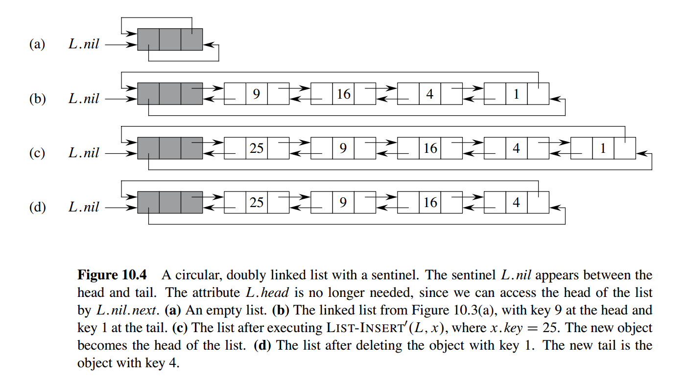

# 链表

- 列表分为很多种类：双向链表、单向链表；有序链表、无序链表、循环链表等。
- 双向链表中的每个节点都有如下属性 `key, next, prev`；

## 用指针实现链表

```fake
// 链表的搜索
LIST-SEARCH(L, x)
    x = L.head
    while x != NIL and x.key != k
        x = x.next
    return x

// 在链表的头部插入元素
LIST-INSERT(L, x)
    x.next = L.head
    if L.head != NIL
        L.head.prev = x
    L.head = x
    x.prev = NIL

// 从链表中删除元素
LIST-DELETE(L, x)
    if x.prev != NIL
        x.prev.next = x.next
    else
        L.head == x.next
    if x.next != NIL
        x.next.prev = x.prev
```

## 通过插入 NIL 节点可以不用区分链表的首位节点


始终保持一个空节点（也叫哨兵节点）用来表示空节点，连接头节点和尾节点，可以简化链表的算法

```fake
LIST-DELETE'(L, x)
    x.prev.next = x.next
    x.next.prev = x.prev

LIST-SEARCH'(L, k)
    x = L.nil.next
    while x != L.nil and x.key != k
        x = x.next
    return x

LIST-INSERT'(L, x)
    x.next = L.nil.next
    L.nil.next.prev = x
    L.nil.next = x
    x.prev = L.nil
```

## 使用数组实现链表

1. 用三个数组`next, key, prev`，可以表示出链表；
2. 用一个数组，通过设置 offset 来实现，相邻的三个元素分别表示 `next， key， prev`信息；
3. 分配和管理空闲空间，通过增加一个单向链表来进行分配和管理链表元素。

## 常见问题

### 链表逆置

头插法、尾插法、就地逆置

```cpp
/**
 * 链表逆序，非递归实现。
*/
ListNode *listReverse(ListNode *head)
{
    ListNode *newHead = NULL, *current = head;
    while (current) {
        ListNode *next = current->next;
        current->next = newHead;
        newHead = current;
        current = next;
    }

    return newHead;
}

/**
 * 链表逆序，递归实现。
 */
ListNode *listReverseRecursive(ListNode *head)
{
    if (!head || !head->next) {
        return head;
    }

    ListNode *reversedHead = listReverseRecursive(head->next);
    head->next->next = head;
    head->next = NULL;
    return reversedHead;
}
```

### 链表复制

```cpp
/**
 * 链表复制-非递归
 */
ListNode *listCopy(ListNode *head)
{
    ListNode *current = head, *newHead = NULL, *newTail = NULL;
    while (current) {
        ListNode *node = listNewNode(current->value);
        if (!newHead) { // 第一个结点
            newHead = newTail = node;
        } else {
            newTail->next = node;
            newTail = node;
        }
        current = current->next;
    }
    return newHead;
}

/**
 * 链表复制-递归
 */
ListNode *listCopyRecursive(ListNode *head)
{
    if (!head)
        return NULL;

    ListNode *newHead = listNewNode(head->value);
    newHead->next = listCopyRecursive(head->next);
    return newHead;
}
```

### 链表合并

```cpp
/**
 * 链表合并-非递归
 */
ListNode *listMerge(ListNode *list1, ListNode *list2)
{
    ListNode dummy; // 使用空结点保存合并链表
    ListNode *tail = &dummy;

    if (!list1)
        return list2;

    if (!list2)
        return list1;

    while (list1 && list2) {
        if (list1->value <= list2->value) {
            tail->next = list1;
            tail = list1;
            list1 = list1->next;
        } else {
            tail->next = list2;
            tail = list2;
            list2 = list2->next;
        }
    }

    if (list1) {
        tail->next = list1;
    } else if (list2) {
        tail->next = list2;
    }

    return dummy.next;
}

ListNode *listMergeRecursive(ListNode *list1, ListNode *list2)
{
    ListNode *result = NULL;

    if (!list1)
        return list2;

    if (!list2)
        return list1;

    if (list1->value <= list2->value) {
        result = list1;
        result->next = listMergeRecursive(list1->next, list2);
    } else {
        result = list2;
        result->next = listMergeRecursive(list1, list2->next);
    }

    return result;
}
```

### 链表相交判断

```cpp
/**
 * 链表相交判断，如果相交返回相交的结点，否则返回NULL。
 */
ListNode *listIntersect(ListNode *list1, ListNode *list2)
{
    int len1 = listLength(list1);
    int len2 = listLength(list2);
    int delta = abs(len1 - len2);

    ListNode *longList = list1, *shortList = list2;

    if (len1 < len2) {
        longList = list2;
        shortList = list1;
    }

    int i;
    for (i = 0; i < delta; i++) {
        longList = longList->next;
    }

    while (longList && shortList) {
        if (longList == shortList)
            return longList;

        longList = longList->next;
        shortList = shortList->next;
    }

    return NULL;
}
```

### 判断链表有环，找到环开始的点

1. 双指针法，一个慢指针一次移动一个距离，一个快指针一次移动两个距离；
2. 我们在第一次相遇时，把慢指针留在原地，把快指针放回起点head处，然后把快指针变为慢指针，**两个指针一起以速度1前进，当它们相遇时** ，相遇点就是入环点4；

```cpp
/**
 * 检测链表是否有环-Flod判圈算法
 * 若存在环，返回相遇结点，否则返回NULL
 */
ListNode *listDetectLoop(ListNode *head)
{
    ListNode *slow, *fast;
    slow = fast = head;

    while (slow && fast && fast->next) {
        slow = slow->next;
        fast = fast->next->next;
        if (slow == fast) {
            printf("Found Loop\n");
            return slow;
        }
    }

    printf("No Loop\n");
    return NULL;
}

void testListDetectLoop()
{
    printf("\nTestListDetectLoop\n");
    int a[] = {1, 2, 3, 4};
    ListNode *head = listCreate(a, ALEN(a));
    listDetectLoop(head);

    // 构造一个环
    head->next->next->next = head;
    listDetectLoop(head);
}

/**
 * 查找链表中环入口
 */
ListNode *findLoopNode(ListNode *head)
{
    ListNode *meetNode = listDetectLoop(head);
    if (!meetNode)
        return NULL;

    ListNode *headNode = head;
    while (meetNode != headNode) {
        meetNode = meetNode->next;
        headNode = headNode->next;
    }
    return meetNode;
}
```

### 链表模拟加法

```cpp
/**
 * 链表模拟加法-非递归解法
 */
ListNode *listEnumarateAdd(ListNode *list1, ListNode *list2)
{
    int carry = 0;
    ListNode *result = NULL;

    while (list1 || list2 || carry) {
        int value = carry;
        if (list1) {
            value += list1->value;
            list1 = list1->next;
        }

        if (list2) {
            value += list2->value;
            list2 = list2->next;
        }

        result = listAddNodeTail(result, value % 10);
        carry = ( value >= 10 ? 1: 0);
    }

    return result;
}

/**
 * 链表模拟加法-递归解法
 */
ListNode *listEnumarateAddRecursive(ListNode *list1, ListNode *list2, int carry)
{
    if (!list1 && !list2 && carry==0)
        return NULL;

    int value = carry;
    if (list1)
        value += list1->value;

    if (list2)
        value += list2->value;

    ListNode *next1 = list1 ? list1->next : NULL;
    ListNode *next2 = list2 ? list2->next : NULL;
    ListNode *more = listEnumarateAddRecursive(next1, next2, (value >= 10 ? 1 : 0));
    ListNode *result = listNewNode(carry);
    result->value = value % 10;
    result->next = more;

    return result;
}
```

### 找到链表的倒数第k个节点

```cpp
/**
* 链表倒数第K个结点-遍历两次算法
*/
ListNode *getLastKthNodeTwice(ListNode *head, int k)
{
    int len = listLength(head);
    if (k > len)
        return NULL;

    ListNode *current = head;
    int i;
    for (i = 0; i < len-k; i++)  //遍历链表，找出第N-K+1个结点
        current = current->next;

    return current;
}

/**
* 链表倒数第K个结点-遍历一次算法
*/
ListNode *getLastKthNodeOnce(ListNode *head, int k)
{
    ListNode *p1, *p2;
    p1 = p2 = head;

    for(; k > 0; k--) {
        if (!p2) // 链表长度不够K
            return NULL;
        p2 = p2->next;
    }

    while (p2) {
        p1 = p1->next;
        p2 = p2->next;
    }
    return p1;
}
```

## Reference

1. [【41期】盘点那些必问的数据结构算法题之链表](https://zhuanlan.zhihu.com/p/109842026)
